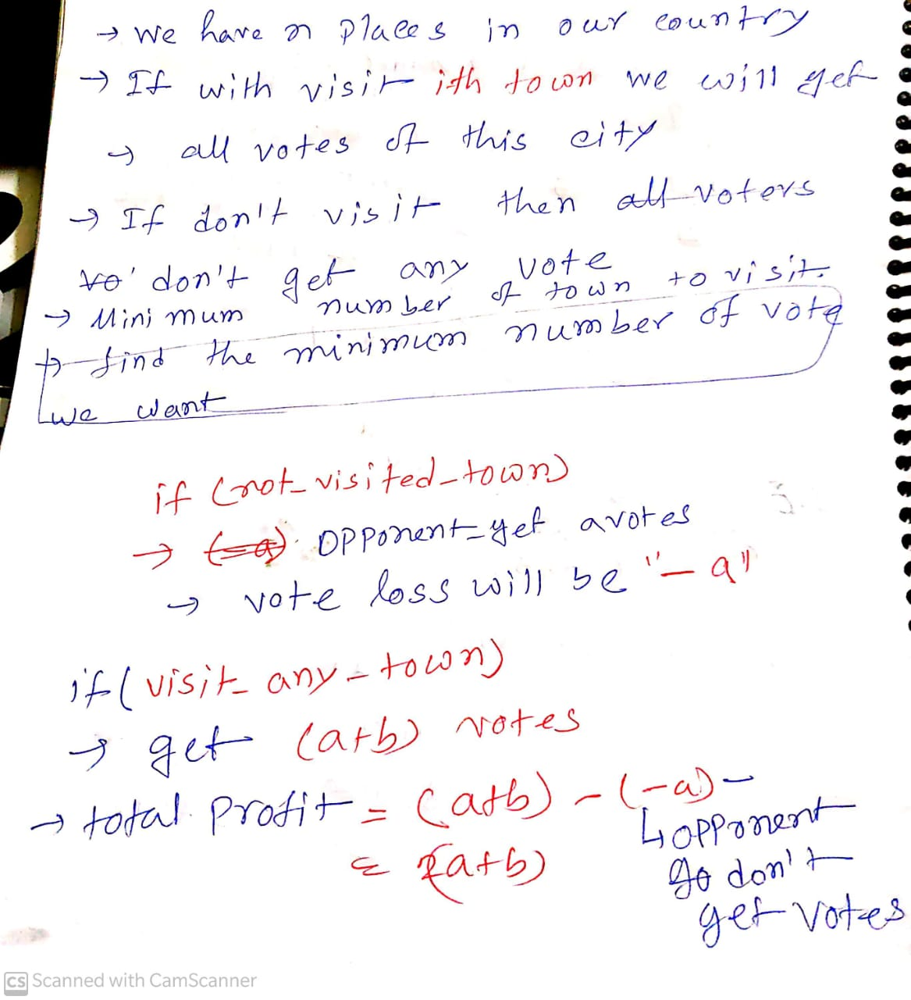

[Problem link](https://atcoder.jp/contests/abc187/tasks/abc187_d)

# Problem statement




# Observation
 

 # Code 
 ```c++
 /*
* @Author: kabbo
* @Date:   2020-06-24 08:40:07
* @Last Modified by:   kabbo
* @Last Modified time: 2020-06-24 08:49:58
*/
#include<bits/stdc++.h>
using namespace std;
#define pii pair<long long,long long>
#define endl '\n'
#define ull unsigned long long
#define ll int64_t
#define ar array
// http://www.open-std.org/jtc1/sc22/wg21/docs/papers/2016/p0200r0.html
template<class Fun>
class y_combinator_result {
    Fun fun_;
public:
    template<class T>
    explicit y_combinator_result(T &&fun): fun_(std::forward<T>(fun)) {}
 
    template<class ...Args>
    decltype(auto) operator()(Args &&...args) {
        return fun_(std::ref(*this), std::forward<Args>(args)...);
    }
};
 
template<class Fun>
decltype(auto) y_combinator(Fun &&fun) {
    return y_combinator_result<std::decay_t<Fun>>(std::forward<Fun>(fun));
}
const int mod = 1e9 + 7;
using u64 = uint64_t;
using u128 = __uint128_t;
#define sc1(x) scanf("%lld",&(x));
mt19937 rnd(chrono::steady_clock::now().time_since_epoch().count());
/*Well, probably you won't understand anything,
because you didn't try to understand anything in your life,
you expect all hard work to be done for you by someone else. 
Let's start*/
void solve() {
    int n;
    cin>>n;
    ll base=0;
    vector<ll>my_vote;
    for(int i(0);i<n;++i){
        ll a,b;
        cin>>a>>b;
        base+=a;
        my_vote.emplace_back(a+a+b);
    }
    sort(my_vote.begin(),my_vote.end());
    while(base>=0 and !my_vote.empty()){
        base-=my_vote.back();
        my_vote.pop_back();
    }
    cout<<n-my_vote.size()<<endl;
}
int main() {

    ios_base::sync_with_stdio(false);
    cin.tie(nullptr);
    // int t;
    // cin>>t;
    // for (int i(1); i <= t; ++i) {
       // printf("Case %d:\n", i);
        solve();
    //}
    return 0;
}
```
> Happy coding :smile: