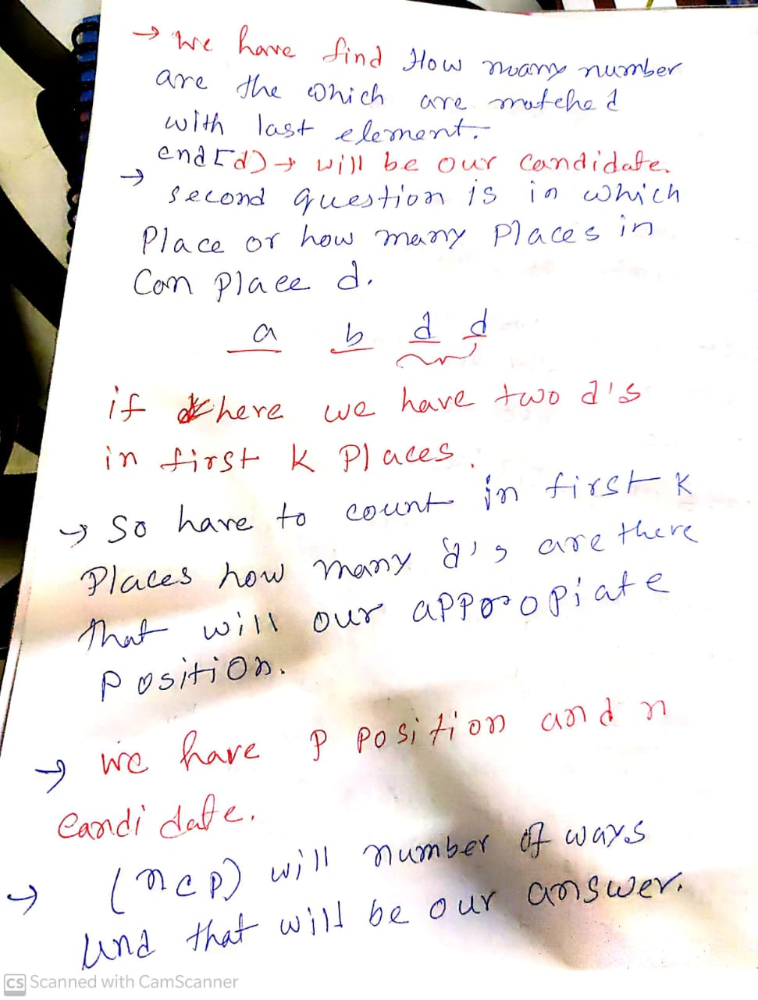

[Problem link](https://codeforces.com/contest/1475/problem/E)

# Problem statement and observation




# Code 
```c++
/*
* @Author: kabbo
* @Date:   2020-06-24 08:40:07
* @Last Modified by:   kabbo
* @Last Modified time: 2020-06-24 08:49:58
*/
#include<bits/stdc++.h>
using namespace std;
#define pii pair<long long,long long>
#define endl '\n'
#define ull unsigned long long
#define ll int64_t
#define ar array
// http://www.open-std.org/jtc1/sc22/wg21/docs/papers/2016/p0200r0.html
template<class Fun>
class y_combinator_result {
    Fun fun_;
public:
    template<class T>
    explicit y_combinator_result(T &&fun): fun_(std::forward<T>(fun)) {}
 
    template<class ...Args>
    decltype(auto) operator()(Args &&...args) {
        return fun_(std::ref(*this), std::forward<Args>(args)...);
    }
};
 
template<class Fun>
decltype(auto) y_combinator(Fun &&fun) {
    return y_combinator_result<std::decay_t<Fun>>(std::forward<Fun>(fun));
}
const int mod = 1e9 + 7;
using u64 = uint64_t;
using u128 = __uint128_t;
#define sc1(x) scanf("%lld",&(x));
mt19937 rnd(chrono::steady_clock::now().time_since_epoch().count());
/*Well, probably you won't understand anything,
because you didn't try to understand anything in your life,
you expect all hard work to be done for you by someone else. 
Let's start*/

template<typename A, typename B> ostream& operator<<(ostream &os, const pair<A, B> &p) { return os << '(' << p.first << ", " << p.second << ')'; }
template<typename T_container, typename T = typename enable_if<!is_same<T_container, string>::value, typename T_container::value_type>::type> ostream& operator<<(ostream &os, const T_container &v) { os << '{'; string sep; for (const T &x : v) os << sep << x, sep = ", "; return os << '}'; }
 
void dbg_out() { cerr << endl; }
template<typename Head, typename... Tail> void dbg_out(Head H, Tail... T) { cerr << ' ' << H; dbg_out(T...); }
 
#ifdef NEAL_DEBUG
#define dbg(...) cerr << "(" << #__VA_ARGS__ << "):", dbg_out(__VA_ARGS__)
#else
#define dbg(...)
#endif
 
template<const int &MOD>
struct _m_int {
    int val;
 
    _m_int(int64_t v = 0) {
        if (v < 0) v = v % MOD + MOD;
        if (v >= MOD) v %= MOD;
        val = int(v);
    }
 
    _m_int(uint64_t v) {
        if (v >= MOD) v %= MOD;
        val = int(v);
    }
 
    _m_int(int v) : _m_int(int64_t(v)) {}
    _m_int(unsigned v) : _m_int(uint64_t(v)) {}
 
    explicit operator int() const { return val; }
    explicit operator unsigned() const { return val; }
    explicit operator int64_t() const { return val; }
    explicit operator uint64_t() const { return val; }
    explicit operator double() const { return val; }
    explicit operator long double() const { return val; }
 
    _m_int& operator+=(const _m_int &other) {
        val -= MOD - other.val;
        if (val < 0) val += MOD;
        return *this;
    }
 
    _m_int& operator-=(const _m_int &other) {
        val -= other.val;
        if (val < 0) val += MOD;
        return *this;
    }
 
    static unsigned fast_mod(uint64_t x, unsigned m = MOD) {
#if !defined(_WIN32) || defined(_WIN64)
        return unsigned(x % m);
#endif
        // Optimized mod for Codeforces 32-bit machines.
        // x must be less than 2^32 * m for this to work, so that x / m fits in an unsigned 32-bit int.
        unsigned x_high = unsigned(x >> 32), x_low = unsigned(x);
        unsigned quot, rem;
        asm("divl %4\n"
            : "=a" (quot), "=d" (rem)
            : "d" (x_high), "a" (x_low), "r" (m));
        return rem;
    }
 
    _m_int& operator*=(const _m_int &other) {
        val = fast_mod(uint64_t(val) * other.val);
        return *this;
    }
 
    _m_int& operator/=(const _m_int &other) {
        return *this *= other.inv();
    }
 
    friend _m_int operator+(const _m_int &a, const _m_int &b) { return _m_int(a) += b; }
    friend _m_int operator-(const _m_int &a, const _m_int &b) { return _m_int(a) -= b; }
    friend _m_int operator*(const _m_int &a, const _m_int &b) { return _m_int(a) *= b; }
    friend _m_int operator/(const _m_int &a, const _m_int &b) { return _m_int(a) /= b; }
 
    _m_int& operator++() {
        val = val == MOD - 1 ? 0 : val + 1;
        return *this;
    }
 
    _m_int& operator--() {
        val = val == 0 ? MOD - 1 : val - 1;
        return *this;
    }
 
    _m_int operator++(int) { _m_int before = *this; ++*this; return before; }
    _m_int operator--(int) { _m_int before = *this; --*this; return before; }
 
    _m_int operator-() const {
        return val == 0 ? 0 : MOD - val;
    }
 
    friend bool operator==(const _m_int &a, const _m_int &b) { return a.val == b.val; }
    friend bool operator!=(const _m_int &a, const _m_int &b) { return a.val != b.val; }
    friend bool operator<(const _m_int &a, const _m_int &b) { return a.val < b.val; }
    friend bool operator>(const _m_int &a, const _m_int &b) { return a.val > b.val; }
    friend bool operator<=(const _m_int &a, const _m_int &b) { return a.val <= b.val; }
    friend bool operator>=(const _m_int &a, const _m_int &b) { return a.val >= b.val; }
 
    static const int SAVE_INV = int(1e6) + 5;
    static _m_int save_inv[SAVE_INV];
 
    static void prepare_inv() {
        // Make sure MOD is prime, which is necessary for the inverse algorithm below.
        for (int64_t p = 2; p * p <= MOD; p += p % 2 + 1)
            assert(MOD % p != 0);
 
        save_inv[0] = 0;
        save_inv[1] = 1;
 
        for (int i = 2; i < SAVE_INV; i++)
            save_inv[i] = save_inv[MOD % i] * (MOD - MOD / i);
    }
 
    _m_int inv() const {
        if (save_inv[1] == 0)
            prepare_inv();
 
        if (val < SAVE_INV)
            return save_inv[val];
 
        _m_int product = 1;
        int v = val;
 
        while (v >= SAVE_INV) {
            product *= MOD - MOD / v;
            v = MOD % v;
        }
 
        return product * save_inv[v];
    }
 
    _m_int pow(int64_t p) const {
        if (p < 0)
            return inv().pow(-p);
 
        _m_int a = *this, result = 1;
 
        while (p > 0) {
            if (p & 1)
                result *= a;
 
            p >>= 1;
 
            if (p > 0)
                a *= a;
        }
 
        return result;
    }
 
    friend ostream& operator<<(ostream &os, const _m_int &m) {
        return os << m.val;
    }
};
 
template<const int &MOD> _m_int<MOD> _m_int<MOD>::save_inv[_m_int<MOD>::SAVE_INV];
 
extern const int MOD = int(1e9) + 7;
using mod_int = _m_int<MOD>;
 
 
vector<mod_int> _factorial = {1, 1}, _inv_factorial = {1, 1};
 
void prepare_factorials(int64_t maximum) {
    static int prepared_maximum = 1;
 
    if (maximum <= prepared_maximum)
        return;
 
    // Prevent increasing maximum by only 1 each time.
    maximum += maximum / 16;
    _factorial.resize(maximum + 1);
    _inv_factorial.resize(maximum + 1);
 
    for (int i = prepared_maximum + 1; i <= maximum; i++) {
        _factorial[i] = i * _factorial[i - 1];
        _inv_factorial[i] = _inv_factorial[i - 1] / i;
    }
 
    prepared_maximum = int(maximum);
}
 
mod_int factorial(int n) {
    if (n < 0) return 0;
    prepare_factorials(n);
    return _factorial[n];
}
 
mod_int inv_factorial(int n) {
    if (n < 0) return 0;
    prepare_factorials(n);
    return _inv_factorial[n];
}
 
mod_int choose(int64_t n, int64_t r) {
    if (r < 0 || r > n) return 0;
    prepare_factorials(n);
    return _factorial[n] * _inv_factorial[r] * _inv_factorial[n - r];
}
 
mod_int permute(int64_t n, int64_t r) {
    if (r < 0 || r > n) return 0;
    prepare_factorials(n);
    return _factorial[n] * _inv_factorial[n - r];
}
 
mod_int inv_choose(int64_t n, int64_t r) {
    assert(0 <= r && r <= n);
    prepare_factorials(n);
    return _inv_factorial[n] * _factorial[r] * _factorial[n - r];
}
 
mod_int inv_permute(int64_t n, int64_t r) {
    assert(0 <= r && r <= n);
    prepare_factorials(n);
    return _inv_factorial[n] * _factorial[n - r];
}

void solve() {
    int n,k;
    cin>>n>>k;
    vector<int>v(n);
    for(auto& x:v)
    cin>>x;
    sort(v.rbegin(),v.rend());
    int candidate=0,positon=0;
    for(int i(0);i<n;++i){
        if(v[i]==v[k-1]){
            candidate++;
            if(i<k)
            positon++;
        }
    }
    cout<<choose(candidate,positon)<<endl;
}
int main() {

    ios_base::sync_with_stdio(false);
    cin.tie(nullptr);
    int t;
    cin>>t;
    for (int i(1); i <= t; ++i) {
       // printf("Case %d:\n", i);
        solve();
    }
    return 0;
}
```
> Happy coding :smile: