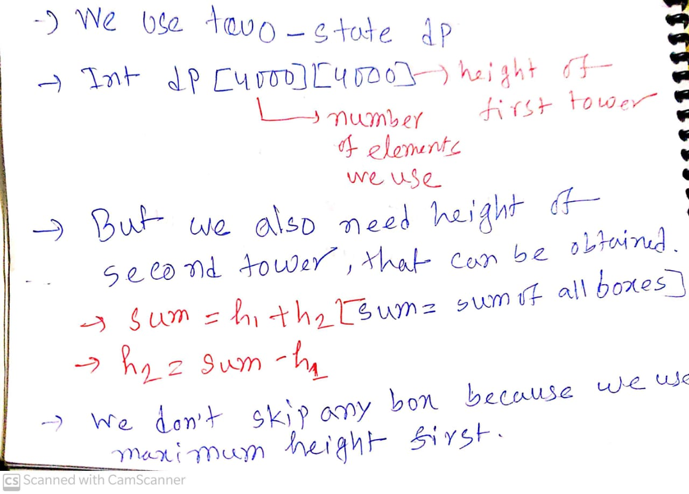
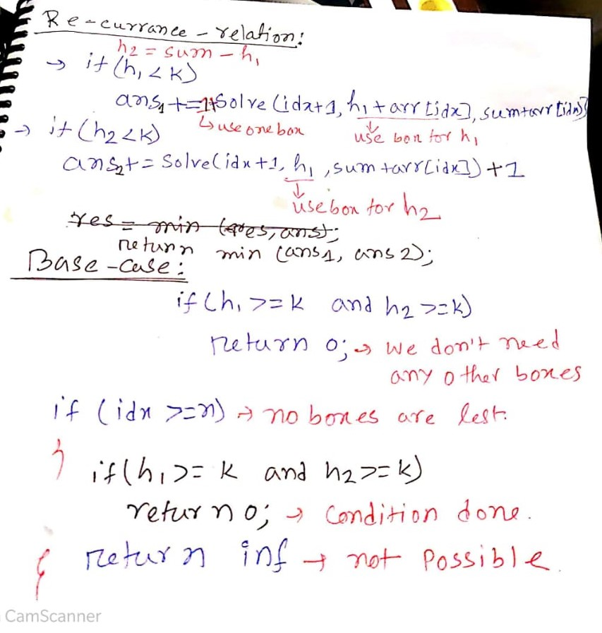

[Problem Link](https://www.codechef.com/JAN21C/problems/WIPL)

# Problem statement
- We have given an array with size n which consist some height of boxes
- we have given K ,where K is the height we have to make by using this box
- we have to made two tower for two players and 
print the minimize number of towers

# Input
- 1≤T≤5

- 1≤N,K≤4,000
- 1≤Hi≤10<sup>5</sup> for each valid i

# Observation
- This is similar to knapsack problem 
- We try the boxes greedily because we have use minimize number of boxes
- when we try any boxes we have two options
-  1. either we use it in first box 
   2. we can use it in second box
- using these condition we try to build re-currence relation
- but here N and K are upto `4000` so can't use third dimentional array, we have to use something 
two dimentional
<div align ="center">
</div>

 ## Recurrance-relation
----
<div align ="center">
</div>

# Implementation
- sort the array in decreasing order
- implement re-currance relation

# Code
```c++
/*
* @Author: kabbo
* @Date:   2020-06-24 08:40:07
* @Last Modified by:   kabbo
* @Last Modified time: 2020-06-24 08:49:58
*/
#include<bits/stdc++.h>
using namespace std;
#define pii pair<long long,long long>
#define endl '\n'
#define ull unsigned long long
#define ll int64_t
#define ar array
// http://www.open-std.org/jtc1/sc22/wg21/docs/papers/2016/p0200r0.html
template<class Fun>
class y_combinator_result {
    Fun fun_;
public:
    template<class T>
    explicit y_combinator_result(T &&fun): fun_(std::forward<T>(fun)) {}
 
    template<class ...Args>
    decltype(auto) operator()(Args &&...args) {
        return fun_(std::ref(*this), std::forward<Args>(args)...);
    }
};
 
template<class Fun>
decltype(auto) y_combinator(Fun &&fun) {
    return y_combinator_result<std::decay_t<Fun>>(std::forward<Fun>(fun));
}
const int mod = 1e9 + 7;
using u64 = uint64_t;
using u128 = __uint128_t;
#define sc1(x) scanf("%lld",&(x));
mt19937 rnd(chrono::steady_clock::now().time_since_epoch().count());
/*Well, probably you won't understand anything,
because you didn't try to understand anything in your life,
you expect all hard work to be done for you by someone else. 
Let's start*/
const int mx=4000+5;
const int inf =1e9+7;
int dp[mx][mx];
void solve() {
    int n,k;
    cin>>n>>k;
    vector<int>arr(n);
    for(auto& x:arr)
    cin>>x;
    sort(arr.rbegin(),arr.rend());
    memset(dp,-1,sizeof(dp));
    auto ans=y_combinator([&](auto rec,int idx,int h1,int sum)->int{
        int h2=sum-h1;
        if(h1>= k and h2>=k)
        return 0;
        if(idx>=n){
            if(h1>=k and h2>=k)
            return 0;
            return inf;
        }
        int &res=dp[idx][h1];
        if(res!=-1)
        return res;
        int ans=inf;
        if(h1<k)
        ans=min(ans,1+rec(idx+1,h1+arr[idx],sum+arr[idx]));
        if(h2<k)
        ans=min(ans,1+rec(idx+1,h1,sum+arr[idx]));
        return res=ans;
    })(0,0,0);

    if(ans>=inf)
    cout<<-1<<endl;
    else 
    cout<<ans<<endl;

    
}
int main() {

    ios_base::sync_with_stdio(false);
    cin.tie(nullptr);
    int t;
    cin>>t;
    for (int i(1); i <= t; ++i) {
       // printf("Case %d:\n", i);
        solve();
    }
    return 0;
}
```
>happy coding :smile:
