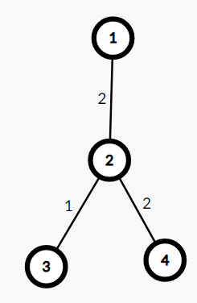
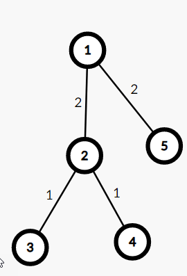
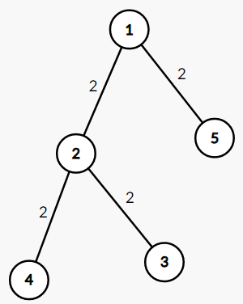

[**Problem Link**](https://www.codechef.com/POPU2021/problems/POPPUSH5)
>Dfs,Tree problem
## **Problem Statement**
---
- The house has n rooms and n-1 bidirectional paths
- For each path lisa is knows that path is clean or not
-  she has n children and ith child can clean all room from path i to 1
`1 is tree root`

- `Minimum number of childs need to clean the the paths`

### Input 
---
- There is N nodes and n-1 edges
- there is given w `if w is 2 then path is dirty` and `if w is 1 path is clean`

## Observation
---
-  First if we see from root to leaf there is maximum of  edges avaiable so it alwasys benefial to choose any leaf node and clean that path it implies that from root to leaf no matter how many path's are dirty we need only one child to clean it and that is always opitmal.

  <div align="center"> 

**Fig:1**</div>


- Here we can see if we choose `leaf 4` then we need only one child we can clean
the pathe `1->2->4`

 <div align="center"> 

**Fig:2**</div>

- Here we can choose `leaft 3 and leaf 5` to clean the path `1->2>3` and `1->5` so out answer will be 2

### **Implementation**
---
- we use dfs to travers from root to leaf and when we find dirty path we push this path into our set and when return from our leaf we have to delete that node

-  `But here is one corner case if every path is dirty then we have to take care of over counting `

<div align="center">

**Fig:3**</div>

- Here we can choose leaf 4 and leaf 3 but we have take care of that 
`in the path 1->2->4 and 1->2->3` we don't over count the path `1->2` 

- For this case our answer will be 3

# Code
```c++
/*
* @Author: kabbo
* @Date:   2020-06-24 08:40:07
* @Last Modified by:   kabbo
* @Last Modified time: 2020-06-24 08:49:58
*/
#include<bits/stdc++.h>
using namespace std;
#define pii pair<long long,long long>
#define endl '\n'
#define ull unsigned long long
#define ll int64_t
#define ar array
// http://www.open-std.org/jtc1/sc22/wg21/docs/papers/2016/p0200r0.html
template<class Fun>
class y_combinator_result {
    Fun fun_;
public:
    template<class T>
    explicit y_combinator_result(T &&fun): fun_(std::forward<T>(fun)) {}

    template<class ...Args>
    decltype(auto) operator()(Args &&...args) {
        return fun_(std::ref(*this), std::forward<Args>(args)...);
    }
};

template<class Fun>
decltype(auto) y_combinator(Fun &&fun) {
    return y_combinator_result<std::decay_t<Fun>>(std::forward<Fun>(fun));
}
const int mod = 1e9 + 7;
using u64 = uint64_t;
using u128 = __uint128_t;
#define sc1(x) scanf("%lld",&(x));
mt19937 rnd(chrono::steady_clock::now().time_since_epoch().count());
/*Well, probably you won't understand anything,
because you didn't try to understand anything in your life,
you expect all hard work to be done for you by someone else.
Let's start*/
void solve() {
    int N;
    cin >> N;
    vector < ar<int, 2>>adj[N + 1];
    for (int i(0); i < N - 1; ++i) {
        int u, v, w;
        cin >> u >> v >> w;
        adj[u].push_back({v, w});
        adj[v].push_back({u, w});
    }
    int ans = 0;
    set<int>dirty;

    auto dfs = y_combinator([&adj, &dirty, &ans](auto rec, int u, int par)->void {
        for (auto [v, w] : adj[u]) {
            //cout << v << " " << w << endl;
            if (v == par)continue;
            if (w == 2) {
                if (dirty.empty())
                    ans++;
                else
                    dirty.clear();
                dirty.insert(v);
            }
            rec(v, u);
            if (w == 2)
                dirty.clear();
        }

    });
    dfs(1, -1) ;
    cout << ans << endl;
}
int main() {

    ios_base::sync_with_stdio(false);
    cin.tie(nullptr);
    // int t;
    // cin>>t;
    // for (int i(1); i <= t; ++i) {
    //     printf("Case %d:\n", i);
    solve();
    //}
    return 0;
}
```
># Happy coding :satisfied:
