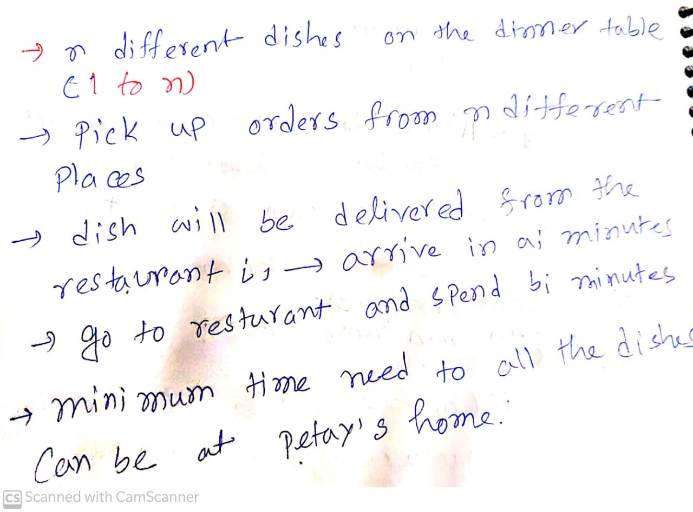

[Problem link](https://codeforces.com/problemset/problem/1443/C)

# Problem statement
<div align= "center">
</div>

# Observation
- Because courier service work in parrallel 
we greedily choose to work with that
- We do binary search on time space and check that  can we complete our task in that time?

- For that we try chk function
- we assume that 
<pre> In **mid**  time we can courier everything
 if(sum_dishes_courier_time > our assume time)
  time+=(time_taken_by_walk_for_i-th_dish)
</pre>

- If our time  is less than equal **mid** it can possible and we reduce the search space

# Implementation

- Try to implement chk function by above formula 
- Try discrete binary search

# Code
```c++
/*
* @Author: kabbo
* @Date:   2020-06-24 08:40:07
* @Last Modified by:   kabbo
* @Last Modified time: 2020-06-24 08:49:58
*/
#include<bits/stdc++.h>
using namespace std;
#define pii pair<long long,long long>
#define endl '\n'
#define ull unsigned long long
#define ll int64_t
#define ar array
// http://www.open-std.org/jtc1/sc22/wg21/docs/papers/2016/p0200r0.html
template<class Fun>
class y_combinator_result {
    Fun fun_;
public:
    template<class T>
    explicit y_combinator_result(T &&fun): fun_(std::forward<T>(fun)) {}
 
    template<class ...Args>
    decltype(auto) operator()(Args &&...args) {
        return fun_(std::ref(*this), std::forward<Args>(args)...);
    }
};
 
template<class Fun>
decltype(auto) y_combinator(Fun &&fun) {
    return y_combinator_result<std::decay_t<Fun>>(std::forward<Fun>(fun));
}
const int mod = 1e9 + 7;
using u64 = uint64_t;
using u128 = __uint128_t;
#define sc1(x) scanf("%lld",&(x));
mt19937 rnd(chrono::steady_clock::now().time_since_epoch().count());
/*Well, probably you won't understand anything,
because you didn't try to understand anything in your life,
you expect all hard work to be done for you by someone else. 
Let's start*/
void solve() {
    int n;
    cin>>n;
    vector<int>a(n),b(n);
    for(auto& i:a)cin>>i;
    for(auto& i:b)cin>>i;
    ll l=0,r=1e12;
    while(r-l>1){
        ll mid=l+r>>1;
        ll time=0;
        for(int i(0);i<n;++i)
         if(a[i]>mid)time+=b[i];
         if(time<=mid)r=mid;
         else l=mid;
    }
    cout<<r<<endl;
}
int main() {

    ios_base::sync_with_stdio(false);
    cin.tie(nullptr);
    int t;
    cin>>t;
    for (int i(1); i <= t; ++i) {
        //printf("Case %d:\n", i);
       solve();
    }
    return 0;
}
```
>Happy Coding :smile: