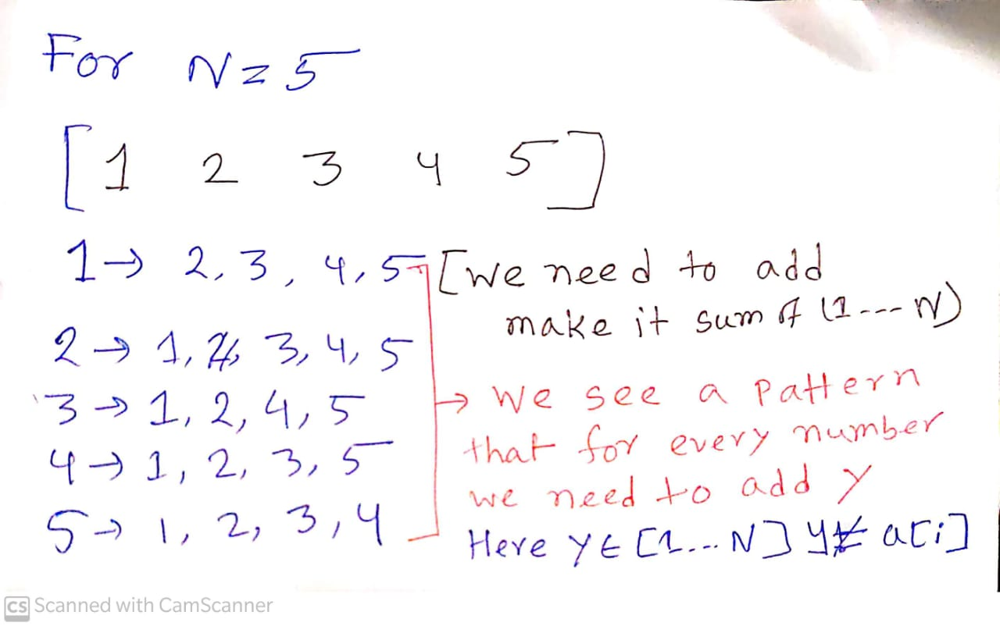

[**Problem Link**](https://codeforces.com/problemset/problem/1447/A)
# Problem Statement
- There is n bags the ith bag contains i candies ,at the end we want all the bags contain equal amount of candies
- We can choose one bag and in the jth operation we add j candies to all bags except the choosen one
- consturt valid sequence of operations

# Input
---
- Given N , where N is the number of bags and  N<= 100

# Observation
- At first total number of candies number of candies in all bags are (n*(n+1)/2)
- we make all number (n*(n+1)/2) 

<div align="center">
</div>
- So we need to add every number except that number to make it equal so we choose ith number in the ith operation so that we don't add <pre class="tab"> <mark>i to the ith number</mark> </pre>

# Implementation
- To construct the array just choose ith element in the i'th operation so that i don't add in i'th element

# Code
---
```c++
/*
* @Author: kabbo
* @Date:   2020-06-24 08:40:07
* @Last Modified by:   kabbo
* @Last Modified time: 2020-06-24 08:49:58
*/
#include<bits/stdc++.h>
using namespace std;
#define pii pair<long long,long long>
#define endl '\n'
#define ull unsigned long long
#define ll int64_t
#define ar array
// http://www.open-std.org/jtc1/sc22/wg21/docs/papers/2016/p0200r0.html
template<class Fun>
class y_combinator_result {
    Fun fun_;
public:
    template<class T>
    explicit y_combinator_result(T &&fun): fun_(std::forward<T>(fun)) {}
 
    template<class ...Args>
    decltype(auto) operator()(Args &&...args) {
        return fun_(std::ref(*this), std::forward<Args>(args)...);
    }
};
 
template<class Fun>
decltype(auto) y_combinator(Fun &&fun) {
    return y_combinator_result<std::decay_t<Fun>>(std::forward<Fun>(fun));
}
const int mod = 1e9 + 7;
using u64 = uint64_t;
using u128 = __uint128_t;
#define sc1(x) scanf("%lld",&(x));
mt19937 rnd(chrono::steady_clock::now().time_since_epoch().count());
/*Well, probably you won't understand anything,
because you didn't try to understand anything in your life,
you expect all hard work to be done for you by someone else. 
Let's start*/
void solve() {
    int n;
    cin>>n;
    cout<<n<<endl;
    for(int i(1);i<=n;++i)
    cout<<i<<" ";
    cout<<endl;
}
int main() {

    ios_base::sync_with_stdio(false);
    cin.tie(nullptr);
    int t;
    cin>>t;
    for (int i(1); i <= t; ++i) {
        //printf("Case %d:\n", i);
        solve();
    }
    return 0;
}
```
>Happy Coding :smile:
