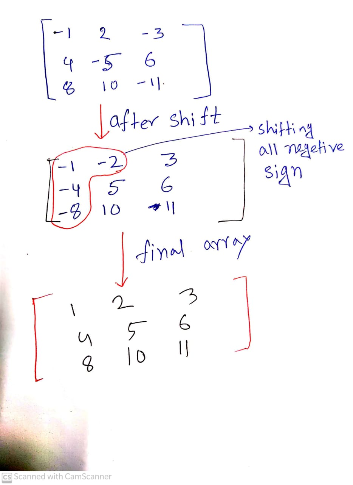

[**Problem Link**](https://codeforces.com/problemset/problem/1447/B)

## Problem statement
---
- given a reactangular grid with n rows and m columns
- we can choose any adjacent cells and multiply with -1 
- we can use a cell more than once
- We have to maximize the sum of the grids

## Input
---
- Given n,m where n is the number of rows and m is the number of columns  and  n<=10 and m<=10
- aij <=100

## Observation
- first key observation is that we have maximize postive intergers in that grid
- first of all we can do as many as operation so 
doing adjacent operations and shift all the negetive numbers in one side
- now if the count of negetive number is odd then after all operation there will be one negetive number
- if count of negetive number is even then there is no negetive number 
<div align= "center">

**Graphical Representation**
</div>

## Implementation
---
- first count the number of negetive numbers 
- if count is odd then we subtract the minimum number from that array to optimize our answer
- otherwise sum of all number is our answer

# Code

```c++
/*
* @Author: kabbo
* @Date:   2020-06-24 08:40:07
* @Last Modified by:   kabbo
* @Last Modified time: 2020-06-24 08:49:58
*/
#include<bits/stdc++.h>
using namespace std;
#define pii pair<long long,long long>
#define endl '\n'
#define ull unsigned long long
#define ll int64_t
#define ar array
// http://www.open-std.org/jtc1/sc22/wg21/docs/papers/2016/p0200r0.html
template<class Fun>
class y_combinator_result {
    Fun fun_;
public:
    template<class T>
    explicit y_combinator_result(T &&fun): fun_(std::forward<T>(fun)) {}
 
    template<class ...Args>
    decltype(auto) operator()(Args &&...args) {
        return fun_(std::ref(*this), std::forward<Args>(args)...);
    }
};
 
template<class Fun>
decltype(auto) y_combinator(Fun &&fun) {
    return y_combinator_result<std::decay_t<Fun>>(std::forward<Fun>(fun));
}
const int mod = 1e9 + 7;
using u64 = uint64_t;
using u128 = __uint128_t;
#define sc1(x) scanf("%lld",&(x));
mt19937 rnd(chrono::steady_clock::now().time_since_epoch().count());
/*Well, probably you won't understand anything,
because you didn't try to understand anything in your life,
you expect all hard work to be done for you by someone else. 
Let's start*/
void solve() {
    int n,m;
    cin>>n>>m;
    vector<int>v(n*m);
    int cnt=0;
    for(auto& x:v){
        cin>>x;
        if(x<0)cnt++;
        x=abs(x);
    }
    ll sum=accumulate(v.begin(),v.end(),(ll)0);
    sort(v.begin(),v.end());
    if(cnt&1)
    cout<<sum-(2*v[0])<<endl;
    else cout<<sum<<endl;
}
int main() {

    ios_base::sync_with_stdio(false);
    cin.tie(nullptr);
    int t;
    cin>>t;
    for (int i(1); i <= t; ++i) {
        //printf("Case %d:\n", i);
        solve();
    }
    return 0;
}
```
>Happy Coding :smile: