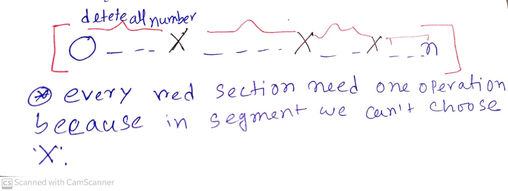

[**Problem Link**](https://codeforces.com/problemset/problem/1454/C)

## Problem statement
---
- we are given an array with n integers
- we have to choose some integer **X** what is present in that array
- we have to an segment which segement doesn't contains x `[l-------r]` and remove that segment
- we have to find minimum number of operations so that array only consist of X
after all operations

## Input
- Given N, N <= `2e5` , N is the number of elements
- Given ai ai<= `2e5` , ai the element of that array

## Observation
---
- Here we first think a brute forces solution ,we try all possible **X** and try to find how many operations we need 
for that particular **X**  and take minimum of them 

- we will use adjacent difference technique to calculate number of operations

<div align="center">

**Fig 1:** </div>

- From fig:1 we can see we need to delete all numbers in that red section because we need only **X** but we can't choose that segment which consist **X**

## Implementation
---
- First push all index of particular **X** in vector
- calculate how many operations need to remove all other elements by adjacent difference method
- minimum of them will be our answer

# Code
```c++
/*
* @Author: kabbo
* @Date:   2020-06-24 08:40:07
* @Last Modified by:   kabbo
* @Last Modified time: 2020-06-24 08:49:58
*/
#include<bits/stdc++.h>
using namespace std;
#define pii pair<long long,long long>
#define endl '\n'
#define ull unsigned long long
#define ll int64_t
#define ar array
// http://www.open-std.org/jtc1/sc22/wg21/docs/papers/2016/p0200r0.html
template<class Fun>
class y_combinator_result {
    Fun fun_;
public:
    template<class T>
    explicit y_combinator_result(T &&fun): fun_(std::forward<T>(fun)) {}
 
    template<class ...Args>
    decltype(auto) operator()(Args &&...args) {
        return fun_(std::ref(*this), std::forward<Args>(args)...);
    }
};
 
template<class Fun>
decltype(auto) y_combinator(Fun &&fun) {
    return y_combinator_result<std::decay_t<Fun>>(std::forward<Fun>(fun));
}
const int mod = 1e9 + 7;
using u64 = uint64_t;
using u128 = __uint128_t;
#define sc1(x) scanf("%lld",&(x));
mt19937 rnd(chrono::steady_clock::now().time_since_epoch().count());
/*Well, probably you won't understand anything,
because you didn't try to understand anything in your life,
you expect all hard work to be done for you by someone else. 
Let's start*/
const int mx=2e5;
void solve() {
   int n;
   cin>>n;
   vector<int>adj[n+1];
   set<int>s;
   for(int i(1);i<=n;++i){
       int x;
       cin>>x;
       adj[x].emplace_back(i);
       s.insert(x);
   } 
   
ll ans=(ll)1e9;
   for(auto x:s){
    adj[x].insert(adj[x].begin(),0);
    adj[x].emplace_back(n+1);
    ll temp=0;
    int prev=0;
    for(auto c:adj[x]){
        if(c-prev>1)
        temp++;
        prev=c;
    }
    ans=min(ans,temp);
   }
   
  cout<<ans<<endl;
}
int main() {

    ios_base::sync_with_stdio(false);
    cin.tie(nullptr);
    int t;
    cin>>t;
    for (int i(1); i <= t; ++i) {
       // printf("Case %d:\n", i);
        solve();
    }
    return 0;
}
```
>Happy Coding :smile: