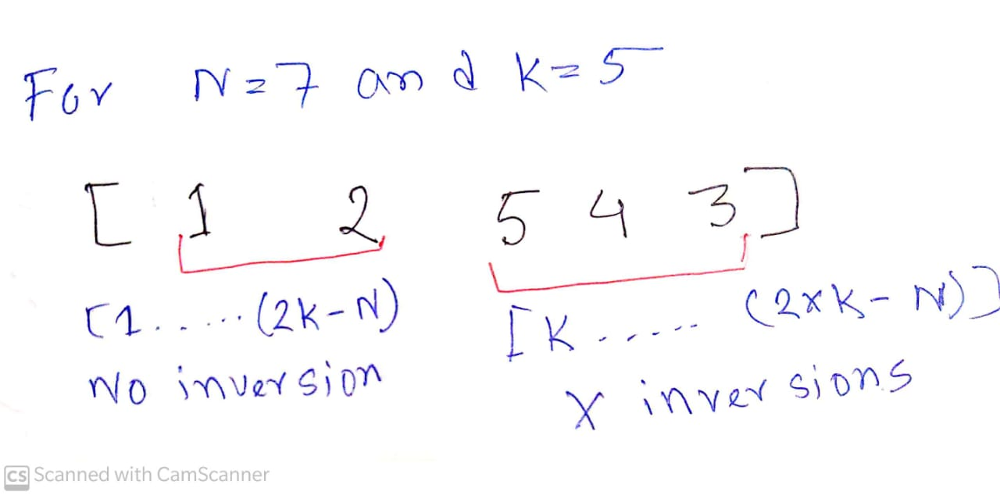

[**Problem Link**](https://codeforces.com/contest/1473/problem/C)
## **Problem Statement**
---
- Given an array `[1....(2*K-N)....K.......(2*K-N)]` Here, (K-(N-K))==(2*K-N) where **X** is the number of inversion in that array
- we have generate a permutation of size K `[1....K]`
- we have construct an array B from permutaion array P
 where `B[i]=P[A[i]]` and number of inversion in array is B is also less than equal **X**
- We have to maximize lexiographically permutation array `P` and print it

## **Input** 
----
- K<N<(2*K)
- K<=10<sup>5

## **Observation**
---
- For Given array A `[(2*K-N)....K.......(2*K-N)]` is palindrom or we say that suffix of an array is palindrome and `[1...(2*K-N)-1]` is sorted means no inversions

- Key observation is here is number of inversion in palindrome is never changed no matter how we re-arrange the numbers in that palindrom

- So construct the permutation array P we use that above property of palindrom and re-arrange the number in decreasing order so that it will become lexiographycally maximum and number of inversion also never changed ,we will see that prove also
<div align="center"> **Fig:1**</div> 

- From Fig:1 we can see our array be constructing from permulation array p `[1 2 5 4 3]` where
`B[i]=P[A[i]]`

## Implementation:
---
- First traverse  [1.....(2*K-N)] and print it in increasing order so that there is no inversions

- Then like **Fig:1** we print [(2*K-N).....K] in reverse order to make it lexiographically maximum


# Proof
---
- ## Number of inversions never change in a palindromi sequence 
---


- For any palindromic sequence number of inversion is 
(size-1)<sup>2 </sup> where size is first half of palindromic sequence

- To make it maximum we put maximum element first 
here K=is the maximum element 


# Code

```c++

/*
* @Author: kabbo
* @Date:   2020-06-24 08:40:07
* @Last Modified by:   kabbo
* @Last Modified time: 2020-06-24 08:49:58
*/
#include<bits/stdc++.h>
using namespace std;
#define pii pair<long long,long long>
#define endl '\n'
#define ull unsigned long long
#define ll int64_t
#define ar array
// http://www.open-std.org/jtc1/sc22/wg21/docs/papers/2016/p0200r0.html
template<class Fun>
class y_combinator_result {
    Fun fun_;
public:
    template<class T>
    explicit y_combinator_result(T &&fun): fun_(std::forward<T>(fun)) {}
 
    template<class ...Args>
    decltype(auto) operator()(Args &&...args) {
        return fun_(std::ref(*this), std::forward<Args>(args)...);
    }
};
 
template<class Fun>
decltype(auto) y_combinator(Fun &&fun) {
    return y_combinator_result<std::decay_t<Fun>>(std::forward<Fun>(fun));
}
const int mod = 1e9 + 7;
using u64 = uint64_t;
using u128 = __uint128_t;
#define sc1(x) scanf("%lld",&(x));
mt19937 rnd(chrono::steady_clock::now().time_since_epoch().count());
/*Well, probably you won't understand anything,
because you didn't try to understand anything in your life,
you expect all hard work to be done for you by someone else. 
Let's start*/
void solve() {
   int N,K;
   cin>>N>>K;
   int lim=(2*K-N);
   for(int i(1);i<lim;++i)
   cout<<i<<" ";
   for(int i(K);i>=lim;--i)
   cout<<i<<" ";
   cout<<endl;

}
int main() {

    ios_base::sync_with_stdio(false);
    cin.tie(nullptr);
    int t;
    cin>>t;
    for (int i(1); i <= t; ++i) {
 //       printf("Case %d:\n", i);
        solve();
    }
    return 0;
}

```

# Hapyy coding :smile:
