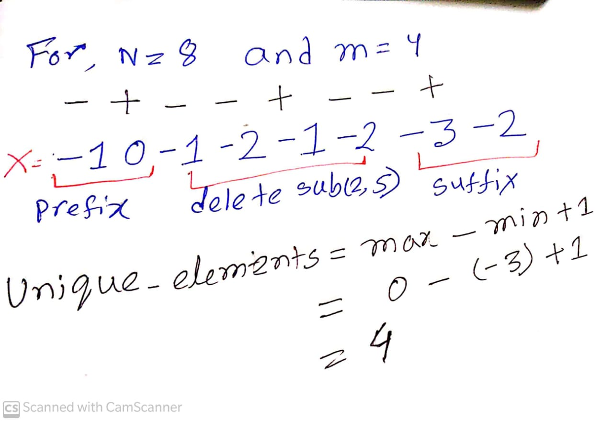
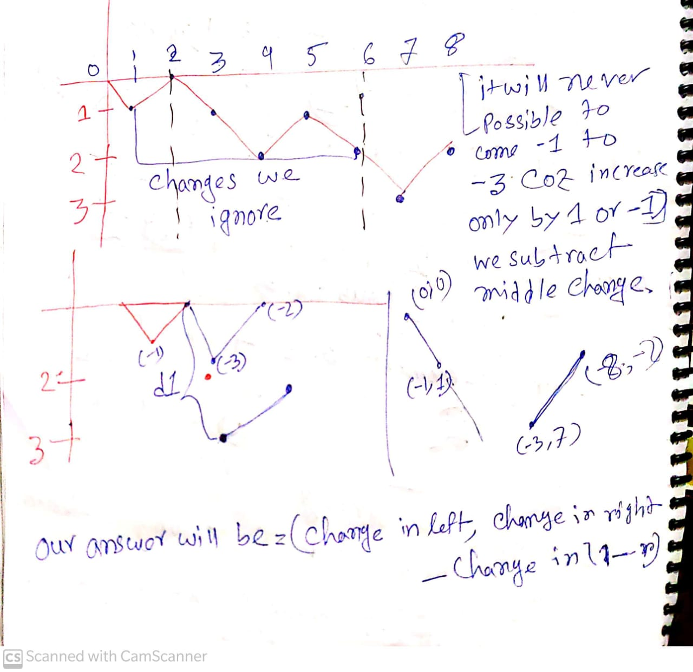
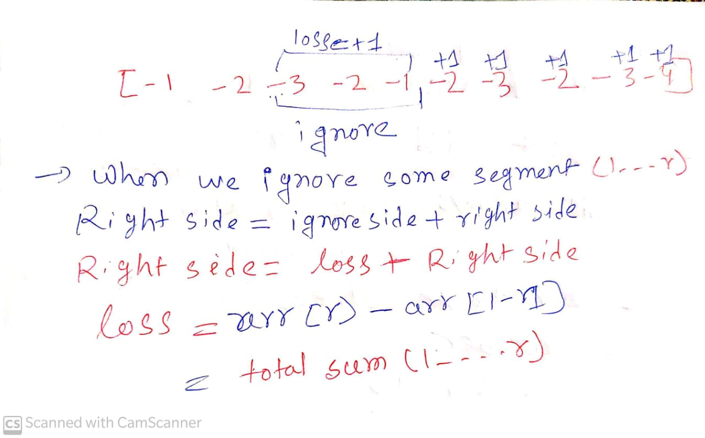

[**Problem Link**](https://codeforces.com/contest/1473/problem/D)

# Problem Stament
- Given an integer X initialize with 0 
- x can be increase by one or decrease by one
- Given a string consist of commands ,according to the command we have to perform some operation and 
consturct and new string with numbers
- we have q queries and one range(**l.....r**) we have to delete substring(l......r) and output how many unique numbers are there

# Input
- Given n,m where n is the length of the string and m is the number of queries
- (1≤n,m≤2⋅105) 

# Observation
- First we construct an array and we have to delete some substring 
- After deleting that sub-string we are left with some prefix and suffix
<div align="center">

**Fig:1** </div>

- So find min we use prefix and suffix sum or we can say that
 min(prefix_min,suffix_min) and max(prefix_max,suffix_max)

- <pre tab>But there is one corner case
- if we plot **Fig:1** in the graph
<div align="center">

**Fig:2** </div>

<div align="center">

**Fig:3** </div>
- we will take maximum change in left and maximum change in right 
and difference between them will be our answer

# Implementation
- Use segment tree to maintain min and max in our array
- answer will be =(quere(l-1),query(r+1)-change(l.....r))

# Code
```c++
/*
* @Author: kabbo
* @Date:   2020-06-24 08:40:07
* @Last Modified by:   kabbo
* @Last Modified time: 2020-06-24 08:49:58
*/
#include<bits/stdc++.h>
using namespace std;
#define pii pair<long long,long long>
#define endl '\n'
#define ull unsigned long long
#define ll int64_t
#define ar array
// http://www.open-std.org/jtc1/sc22/wg21/docs/papers/2016/p0200r0.html
template<class Fun>
class y_combinator_result {
    Fun fun_;
public:
    template<class T>
    explicit y_combinator_result(T &&fun): fun_(std::forward<T>(fun)) {}
 
    template<class ...Args>
    decltype(auto) operator()(Args &&...args) {
        return fun_(std::ref(*this), std::forward<Args>(args)...);
    }
};
 
template<class Fun>
decltype(auto) y_combinator(Fun &&fun) {
    return y_combinator_result<std::decay_t<Fun>>(std::forward<Fun>(fun));
}
const int mod = 1e9 + 7;
using u64 = uint64_t;
using u128 = __uint128_t;
#define sc1(x) scanf("%lld",&(x));
mt19937 rnd(chrono::steady_clock::now().time_since_epoch().count());
/*Well, probably you won't understand anything,
because you didn't try to understand anything in your life,
you expect all hard work to be done for you by someone else. 
Let's start*/
const int inf=1e9;
/*Well, probably you won't understand anything,
because you didn't try to understand anything in your life,
you expect all hard work to be done for you by someone else. 
Let's start*/
const int mx=2e5+5;

struct node{
    int min,max,sum;
};
node seg[4*mx];
int arr[mx];
int getSegmentTreeSize(int N) {
  int size = 1;
  for (; size < N; size <<= 1);
  return size << 1;
}
node assign_leaf(int x){
       node ans;
       ans.min=x;
       ans.max=x;
       ans.sum=x;
       return ans;
}
node invalid(){
    node ans;
    ans.min=inf;
    ans.max=-inf;
    ans.sum=0;
    return ans;
}
node merge(node left,node right){
    node ans;
    ans.min=min(left.min,right.min);
    ans.max=max(left.max,right.max);
    ans.sum=left.sum+right.sum;
    return ans;
}
void build(int stindex,int lo,int hi){
    if(lo==hi){
        seg[stindex]=assign_leaf(arr[lo]);
        return;
    }
    int left=2*stindex,right=left+1,mid=(lo+hi)/2;
    build(left,lo,mid);
    build(right,mid+1,hi);
    seg[stindex]=merge(seg[left],seg[right]);
}
node query (int stindex,int st,int ed,int l,int r){
    if(l>r)
    return invalid();
    if(st==l and ed==r){
        return seg[stindex];
    }
    int mid=(st+ed)/2;
    node left=query(2*stindex,st,mid,l,min(mid,r));
    node right=query(2*stindex+1,mid+1,ed,max(l,mid+1),r);
    return merge(left,right);
}
void solve() {
    int n,m;
    cin>>n>>m;
    string str;
    cin>>str;
    int x=0;
    for(int i(0);i<n;++i){
         x+=(str[i]=='+'?1:-1);
         arr[i+1]=x;
    }
    build(1,1,n);
    while(m--){
        int l,r;
        cin>>l>>r;
        int delta=arr[r]-arr[l-1];
        auto p=query(1,1,n,1,l-1);
        auto q=query(1,1,n,r+1,n);
        int boro=max({p.max,q.max-delta,0});
        int choto=min({p.min,q.min-delta,0});
        cout<<boro-choto+1<<endl;
    }
}
int main() {

    ios_base::sync_with_stdio(false);
    cin.tie(nullptr);
    int t;
    cin>>t;
    for (int i(1); i <= t; ++i) {
        //printf("Case %d:\n", i);
        solve();
    }
    return 0;
}
```
> Happy Coding :smile: