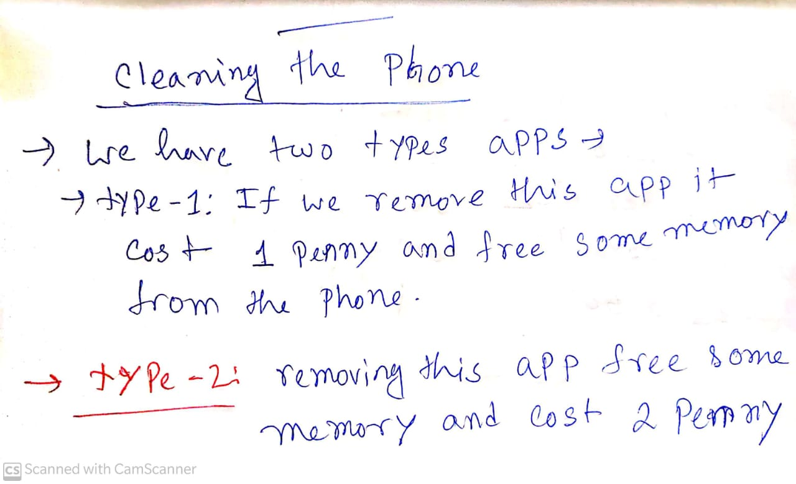
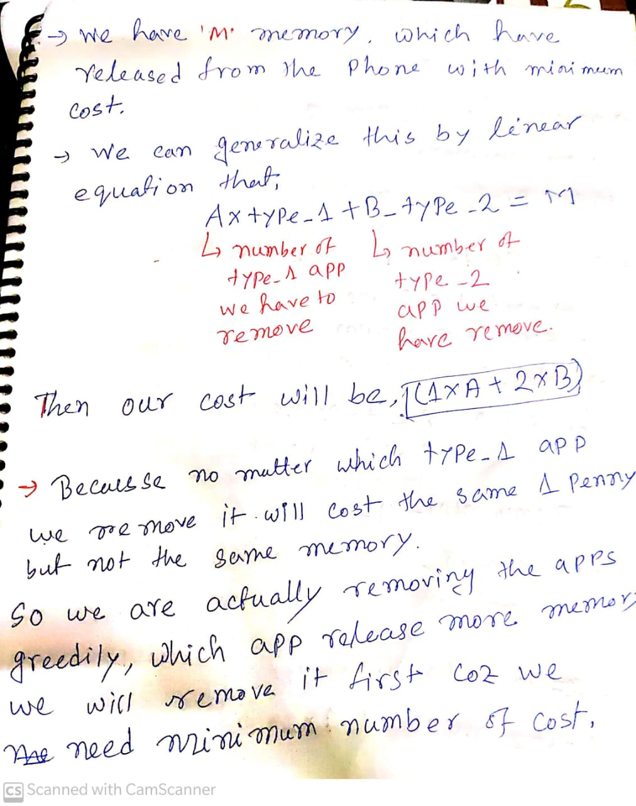
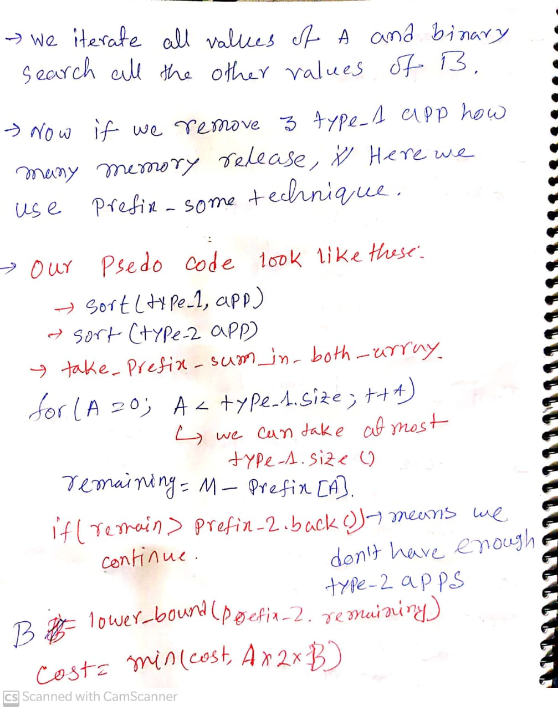

[problem link](https://codeforces.com/contest/1475/problem/D)

# Observation and Problem statement





# Code 
```c++
/*
* @Author: kabbo
* @Date:   2020-06-24 08:40:07
* @Last Modified by:   kabbo
* @Last Modified time: 2020-06-24 08:49:58
*/
#include<bits/stdc++.h>
using namespace std;
#define pii pair<long long,long long>
#define endl '\n'
#define ull unsigned long long
#define ll int64_t
#define ar array
// http://www.open-std.org/jtc1/sc22/wg21/docs/papers/2016/p0200r0.html
template<class Fun>
class y_combinator_result {
    Fun fun_;
public:
    template<class T>
    explicit y_combinator_result(T &&fun): fun_(std::forward<T>(fun)) {}
 
    template<class ...Args>
    decltype(auto) operator()(Args &&...args) {
        return fun_(std::ref(*this), std::forward<Args>(args)...);
    }
};
 
template<class Fun>
decltype(auto) y_combinator(Fun &&fun) {
    return y_combinator_result<std::decay_t<Fun>>(std::forward<Fun>(fun));
}
const int mod = 1e9 + 7;
using u64 = uint64_t;
using u128 = __uint128_t;
#define sc1(x) scanf("%lld",&(x));
mt19937 rnd(chrono::steady_clock::now().time_since_epoch().count());
/*Well, probably you won't understand anything,
because you didn't try to understand anything in your life,
you expect all hard work to be done for you by someone else. 
Let's start*/
const ll inf=1e12;
void solve() {
   int n,m;
   cin>>n>>m;
   ll ans=inf;
   vector<int>v(n);
   
   vector<int>a;
   vector<int>b;
   for(auto& x:v)
   cin>>x;
   for(int i(0);i<n;++i){
       int x;cin>>x;
       if(x==1)
        a.emplace_back(v[i]);
      else 
      b.emplace_back(v[i]);
   }
   sort(a.rbegin(),a.rend());
   sort(b.rbegin(),b.rend());
   vector<ll>pre_a(1,0);
   vector<ll>pre_b(1,0);
   for(auto& x:a){
       pre_a.emplace_back(pre_a.back()+x);
   }
   for(auto& x:b){
       pre_b.emplace_back(pre_b.back()+x);
   }
   for(int A=0;A<pre_a.size();++A){
       ll rem=m-pre_a[A];
       if(pre_b.back()<rem)continue;
       ll B=lower_bound(pre_b.begin(),pre_b.end(),rem)-pre_b.begin();
       ans=min(ans,A+2*B);
   }
   cout<<(ans==inf?-1:ans)<<endl;
}
int main() {

    ios_base::sync_with_stdio(false);
    cin.tie(nullptr);
    int t;
    cin>>t;
    for (int i(1); i <= t; ++i) {
 //       printf("Case %d:\n", i);
        solve();
    }
    return 0;
}
```
>Happy coding :smile:
