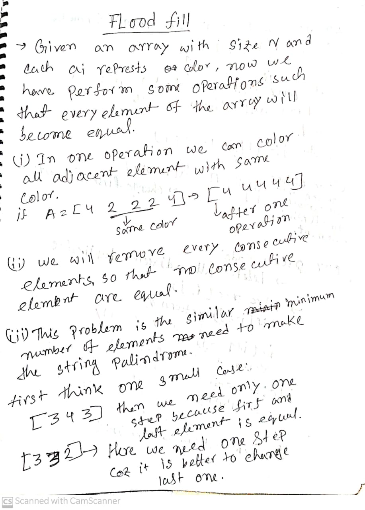

[Problem Link](https://codeforces.com/contest/1114/problem/D)

# Observation and statement




# Code
```c++
/*
* @Author: kabbo
* @Date:   2020-06-24 08:40:07
* @Last Modified by:   kabbo
* @Last Modified time: 2020-06-24 08:49:58
*/
#include<bits/stdc++.h>
using namespace std;
#define pii pair<long long,long long>
#define endl '\n'
#define ull unsigned long long
#define ll int64_t
#define ar array
// http://www.open-std.org/jtc1/sc22/wg21/docs/papers/2016/p0200r0.html
// template<class Fun>
// class y_combinator_result {
//     Fun fun_;
// public:
//     template<class T>
//     explicit y_combinator_result(T &&fun): fun_(std::forward<T>(fun)) {}
 
//     template<class ...Args>
//     decltype(auto) operator()(Args &&...args) {
//         return fun_(std::ref(*this), std::forward<Args>(args)...);
//     }
// };
 
// template<class Fun>
// decltype(auto) y_combinator(Fun &&fun) {
//     return y_combinator_result<std::decay_t<Fun>>(std::forward<Fun>(fun));
// }
const int mod = 1e9 + 7;
using u64 = uint64_t;
using u128 = __uint128_t;
#define sc1(x) scanf("%lld",&(x));
mt19937 rnd(chrono::steady_clock::now().time_since_epoch().count());
/*Well, probably you won't understand anything,
because you didn't try to understand anything in your life,
you expect all hard work to be done for you by someone else. 
Let's start*/
const int mx=5000+5;
int dp[mx][mx];
const int inf=1e7;
vector<int>s;
int sol(int i,int j){
    if(i>j)return inf;
    if(i==j) return 0;
    int &ret=dp[i][j];
    if(ret!=-1)return ret;
    ret=2e9;
    if(s[i]==s[j])ret=1+sol(i+1,j-1);
    ret=min(ret,1+min(sol(i+1,j),sol(i,j-1)));
    return ret;
}
void solve() {
    int n;
    cin>>n;
    for(int i(0);i<n;++i){
        int x;
        cin>>x;
        s.emplace_back(x);
    }
    s.erase(unique(s.begin(),s.end()),s.end());
    memset(dp,-1,sizeof(dp));
    cout<<sol(0,s.size()-1)<<endl;
    
}
int main() {

    ios_base::sync_with_stdio(false);
    cin.tie(nullptr);
 //   int t;
   // cin>>t;
    //for (int i(1); i <= t; ++i) {
      //  printf("Case %d:\n", i);
        solve();
    //}
    return 0;
}
```
>happy coding :smile: