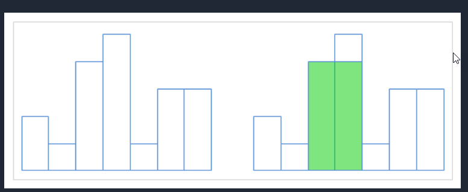
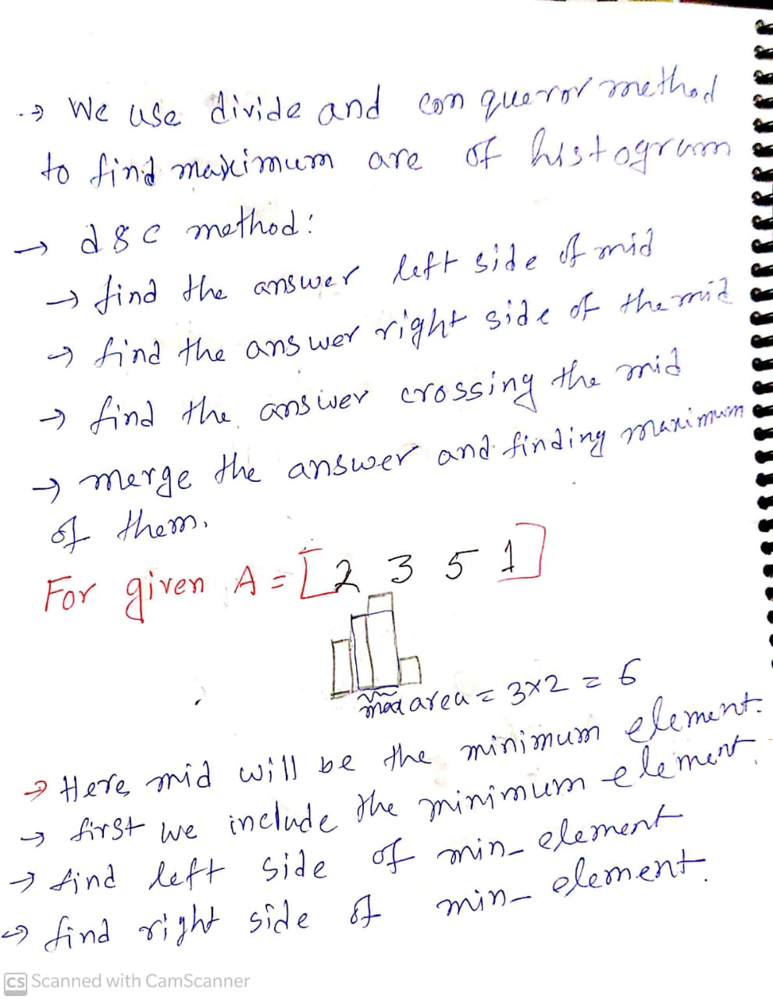
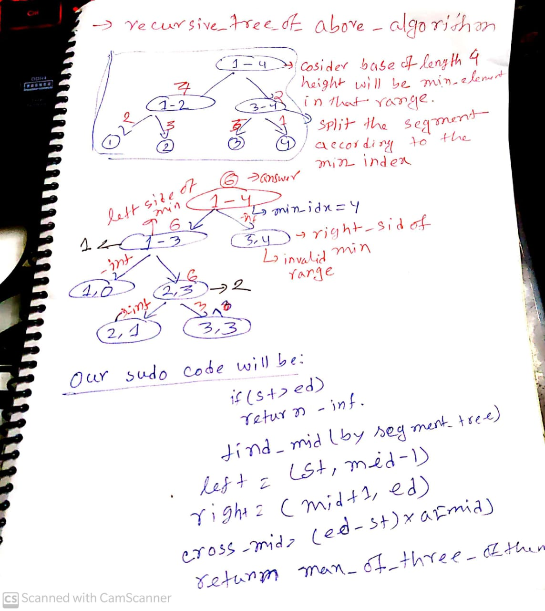

[Problem Link](https://lightoj.com/problem/histogram)

# Observation
- we have a histogram like this 
<div align="center">
</div>

- we have to find the maximum are of this histogram

# Divide and conqueror method




# Code 
```c++
/*
* @Author: kabbo
* @Date:   2020-06-24 08:40:07
* @Last Modified by:   kabbo
* @Last Modified time: 2020-06-24 08:49:58
*/
#include<bits/stdc++.h>
using namespace std;
#define pii pair<long long,long long>
#define endl '\n'
#define ull unsigned long long
#define ll int64_t
#define ar array
// http://www.open-std.org/jtc1/sc22/wg21/docs/papers/2016/p0200r0.html
template<class Fun>
class y_combinator_result {
    Fun fun_;
public:
    template<class T>
    explicit y_combinator_result(T &&fun): fun_(std::forward<T>(fun)) {}
 
    template<class ...Args>
    decltype(auto) operator()(Args &&...args) {
        return fun_(std::ref(*this), std::forward<Args>(args)...);
    }
};
 
template<class Fun>
decltype(auto) y_combinator(Fun &&fun) {
    return y_combinator_result<std::decay_t<Fun>>(std::forward<Fun>(fun));
}
const int mod = 1e9 + 7;
using u64 = uint64_t;
using u128 = __uint128_t;
#define sc1(x) scanf("%lld",&(x));
mt19937 rnd(chrono::steady_clock::now().time_since_epoch().count());
/*Well, probably you won't understand anything,
because you didn't try to understand anything in your life,
you expect all hard work to be done for you by someone else. 
Let's start*/
const int mx=3e4+5;
const int inf=1e9;

struct node{
    int min,max,sum,minidx;
};
node seg[4*mx];
int arr[mx];
int getSegmentTreeSize(int N) {
  int size = 1;
  for (; size < N; size <<= 1);
  return size << 1;
}
node assign_leaf(int x,int i){
       node ans;
       ans.min=x;
       ans.max=x;
       ans.sum=x;
       ans.minidx=i;
       return ans;
}
node invalid(){
    node ans;
    ans.min=inf;
    ans.max=-inf;
    ans.sum=0;
    return ans;
}
node merge(node left,node right){
   if(left.min<right.min)
   return left;
   return right;
}
void build(int stindex,int lo,int hi){
    if(lo==hi){
        seg[stindex]=assign_leaf(arr[lo],lo);
        return;
    }
    int left=2*stindex,right=left+1,mid=(lo+hi)/2;
    build(left,lo,mid);
    build(right,mid+1,hi);
    seg[stindex]=merge(seg[left],seg[right]);
}
node query (int stindex,int st,int ed,int l,int r){
    if(l>r)
    return invalid();
    if(st==l and ed==r){
        return seg[stindex];
    }
    int mid=(st+ed)/2;
    node left=query(2*stindex,st,mid,l,min(mid,r));
    node right=query(2*stindex+1,mid+1,ed,max(l,mid+1),r);
    return merge(left,right);
}

void solve() {
    int n;
    cin>>n;
    for(int i(1);i<=n;++i)
    cin>>arr[i];
    build(1,1,n);
    auto ans=y_combinator([&](auto rec,int st,int ed)->int{
        //cout<<st<<" "<<ed<<endl;
        if(st>ed)
           return -inf;
        if(st==ed)
        return arr[st];
        auto p=query(1,1,n,st,ed);
        int mid=p.minidx;
        return max({rec(st,mid-1),rec(mid+1,ed),(ed-st+1)*arr[mid]});
    })(1,n);
    printf("%d\n",ans);
    
}
int main() {

    ios_base::sync_with_stdio(false);
    cin.tie(nullptr);
     int t;
     cin>>t;
     for (int i(1); i <= t; ++i) {
        printf("Case %d: ", i);
        solve();
    }
    return 0;
}
```