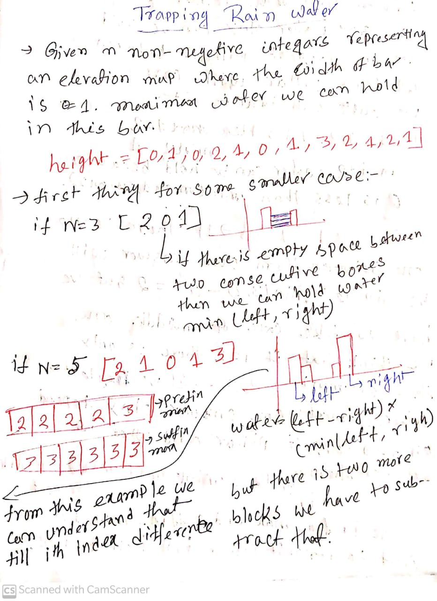
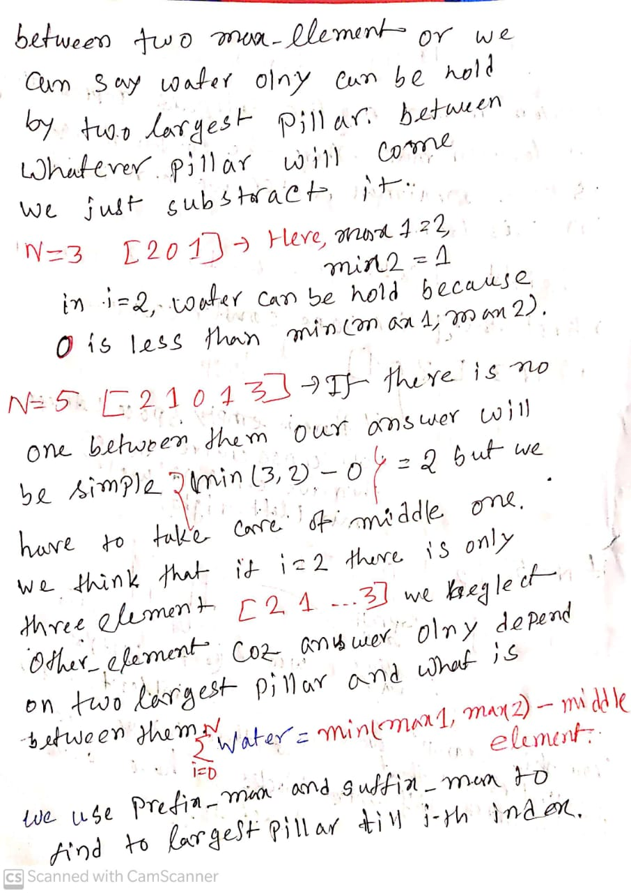

[Proble Link](https://leetcode.com/problems/trapping-rain-water/)

# Observation and Problem statement




# Code
```c++
/*
* @Author: kabbo
* @Date:   2020-06-24 08:40:07
* @Last Modified by:   kabbo
* @Last Modified time: 2020-06-24 08:49:58
*/
#include<bits/stdc++.h>
using namespace std;
#define pii pair<long long,long long>
#define endl '\n'
#define ull unsigned long long
#define ll int64_t
#define ar array
// http://www.open-std.org/jtc1/sc22/wg21/docs/papers/2016/p0200r0.html
// template<class Fun>
// class y_combinator_result {
//     Fun fun_;
// public:
//     template<class T>
//     explicit y_combinator_result(T &&fun): fun_(std::forward<T>(fun)) {}
 
//     template<class ...Args>
//     decltype(auto) operator()(Args &&...args) {
//         return fun_(std::ref(*this), std::forward<Args>(args)...);
//     }
// };
 
// template<class Fun>
// decltype(auto) y_combinator(Fun &&fun) {
//     return y_combinator_result<std::decay_t<Fun>>(std::forward<Fun>(fun));
// }
const int mod = 1e9 + 7;
using u64 = uint64_t;
using u128 = __uint128_t;
#define sc1(x) scanf("%lld",&(x));
mt19937 rnd(chrono::steady_clock::now().time_since_epoch().count());
/*Well, probably you won't understand anything,
because you didn't try to understand anything in your life,
you expect all hard work to be done for you by someone else. 
Let's start*/
void solve() {
    int n;
    cin>>n;
    vector<int>v(n);
    for(auto& x:v)
    cin>>x;
    vector<int>left(1,v[0]);
    vector<int>right(n);
    right[n-1]=v[n-1];
    for(int i(1);i<n;++i)
    left.emplace_back(max(left.back(),v[i]));
    for(int i(n-2);~i;--i)
    right[i]=max(right[i+1],v[i]);
    ll ans=0;
    for(int i(0);i<n;++i)
    ans+=min(left[i],right[i])-v[i];
    cout<<ans<<endl;
}
int main() {

    ios_base::sync_with_stdio(false);
    cin.tie(nullptr);
    //int t;
    //cin>>t;
    //for (int i(1); i <= t; ++i) {
   //     printf("Case %d:\n", i);
        solve();
 //   }
    return 0;
}
```
>Happy coding :smile: